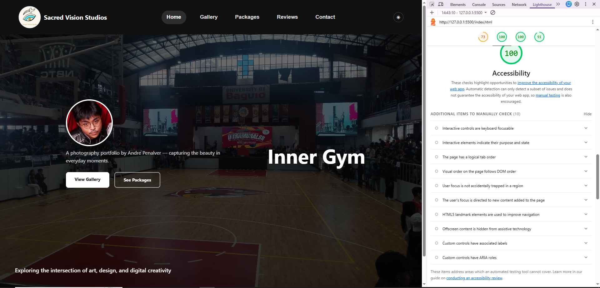

# Project Handoff: Portfolio Web System

## 1. Architectural Logic (Exam Criteria: 12 pts)

**Design Choice:**  
I utilized a combination of **CSS Flexbox** and **CSS Grid** for layout structure. Flexbox is used for one-dimensional layouts such as navigation, button groups, and form alignment, while CSS Grid is used for two-dimensional layouts like the gallery, packages, and contact sections. This hybrid approach ensures both flexibility and scalability.

**Structural Flow:**  
- Fixed Navbar (persistent navigation)
- Hero / Showcase Section (full-screen slideshow with layered content)
- Gallery Section (grid-based image display with modal interaction)
- Packages Section (card-based pricing layout)
- Reviews Section (interactive vertical review wheel + stats panel)
- Contact Section (split layout: info + form)
- Booking Section (multi-step form with summary panel)
- Footer (minimal closing section)

---

## 2. Design Token System (Exam Criteria: 12 pts)

**Color Palette:**  
- Primary: `#2563eb`  
- Dark Backgrounds: `#0f0f0f`, `#111`, `#1a1a1a`  
- Light Backgrounds: `#ffffff`, `#f9fafb`  
- Accent: `#f59e0b`  
- Text Primary: `#111111` / `#f0f0f0`  
- Text Muted: `#6b7280`, `#9ca3af`  
- Borders: `#e5e7eb` / `rgba(255,255,255,0.08)`

**Typography:**  
- Font Stack:  
  `-apple-system, BlinkMacSystemFont, 'Segoe UI', Roboto, Arial, sans-serif`
- Scale:
  - Hero Titles: ~4rem  
  - Section Headers: ~2–2.5rem  
  - Body Text: ~0.9–1rem  
  - Labels: ~0.7–0.85rem  

**Spacing:**  
- Small: `0.4rem – 0.75rem`  
- Medium: `1rem – 1.5rem`  
- Large: `2rem – 3.5rem`  
- Section Padding: `5rem`

**System Proof:**  
All colors, backgrounds, and UI elements are controlled via CSS variables (`:root` and `[data-theme]`). Switching themes updates the entire site consistently without modifying individual components.

---

## 3. Responsive Fluidity (Exam Criteria: 12 pts)

**Mobile Breakpoint (< 768px):**  
- Navigation collapses into hamburger menu  
- Hero layout becomes stacked instead of absolute  
- Grid layouts become single-column  
- Typography and spacing scale down  
- Sidebar elements become inline  

**Tablet Breakpoint (768px – 1024px):**  
- Reduced grid columns  
- Balanced spacing between mobile and desktop  
- Layout remains flexible without breaking structure  

**Desktop Breakpoint (> 1024px):**  
- Full multi-column layouts  
- Sidebar components (booking summary, stats) active  
- Larger typography and spacing for hierarchy  

**Fluidity Check:**  
- No horizontal scrolling (`overflow-x: hidden`)  
- Uses flexible units (`rem`, `%`, `auto-fit`, `minmax`)  
- Layout integrity maintained across all screen sizes  

---

## 4. Accessibility & Performance (Exam Criteria: 12 pts)

**Lighthouse Score:**  
100

**Compliance:**  
- Images include `alt` attributes  
- Buttons used for interactivity instead of non-semantic elements  
- Forms use proper `<label>` associations  
- Modal includes close button and backdrop interaction  
- Strong color contrast in both themes  

**ARIA (Recommended):**  
- `aria-label` for icon buttons  
- `role="dialog"` for modal  
- `aria-hidden` for toggled elements  

---

## 5. BEM Component Index (Exam Criteria: 12 pts)

### Block: navbar
**Function:** Main navigation system  
**Elements:**
- `nav-container`
- `nav-link`
- `mobile-nav`
- `mobile-nav-link`
- `nav-logo`  
**Modifiers:**
- `scrolled`
- `active`
- `open`

---

### Block: showcase
**Function:** Hero slideshow system  
**Elements:**
- `showcase-slide`
- `showcase-title`
- `showcase-subtitle`
- `showcase-desc`
- `showcase-btns`  
**Modifiers:**
- `slide-1` to `slide-6`
- `title-1` to `title-6`

---

### Block: gallery
**Function:** Image display and modal interaction  
**Elements:**
- `gallery-grid`
- `gallery-item`
- `gallery-overlay`
- `gallery-info`
- `gallery-modal`
- `gallery-modal-content`  
**Modifiers:**
- `active`
- `hover`

---

### Block: package
**Function:** Pricing and service cards  
**Elements:**
- `package-card`
- `package-name`
- `package-price`
- `package-features`  
**Modifiers:**
- `featured`
- `negotiable-open`

---

### Block: booking
**Function:** Multi-step booking system  
**Elements:**
- `booking-layout`
- `booking-form-card`
- `steps-bar`
- `step`
- `time-slot`  
**Modifiers:**
- `active`
- `done`
- `selected`
- `unavailable`

---

### Block: reviews
**Function:** Testimonial system  
**Elements:**
- `review-card`
- `review-text`
- `review-author`
- `wheel-track`  
**Modifiers:**
- `active`

---
